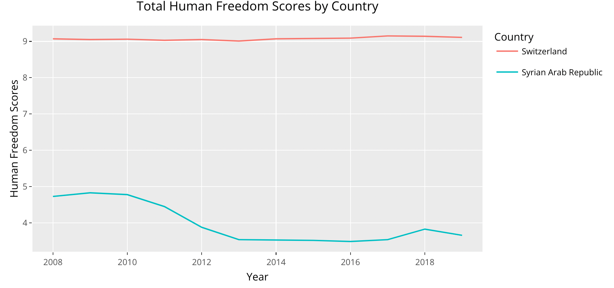

# Conclusion

After reviewing our dataset and the ways we explored the values, we summarized our findings into 3 identifying takeaways that centered our project: the way countries’ human freedom scores have shifted, how the highest and lowest ranked countries have progressed over time, and the influence of freedom of expression rankings from regions’ culture and various other factors. Looking at the main analysis of human freedom and the ways it differs by country, in our **first graph**, we can observe the variations in each countries’ scores, focusing on the shifts between the indexes across time. This allows us to gauge the levels of government involvement and the ways it may have changed as the countries continue to progress and develop, or even how it remains stagnant despite the progression of time. 

With our **second graph**, we observe the ways in which the lowest and highest ranked countries have progressed and change through time. In analyzing the disparities in the highest and lowest ranked countries, we notice the ways in which governed countries are the most and least oppressive, uncovering even unanticipated results that most would not have considered. Our findings help us better understand how human freedom index scores vary in each country and the complications they possess. 

The country we’ve observed with the highest human freedom score of 9.14/10 is Switzerland.
In comparison, the country with the lowest score of 3.83/10 is the Syrian Arab Republic. Below we can analyze how these countries compare. 

In our **third graph**, we can observe trends of the freedom of expression rankings that differ from factors such as culture and other social influences of the regions. In observing the movement of freedom of expression rankings, we can compare the potential impacts of culture and religion in the extent of expression with each region. With this, we gain insight on the limitations in expression upon the countries in which culture, religion, and social influences have been oppressed compared to the countries with higher freedom of expression scores.

Keeping our research in mind, we focused on understanding how the human freedom index impacts the countries that we analyzed. The variations in scores with common and unexpected countries ranking the highest and lowest allow us to view the ethics surrounding how countries compare to one another even in different freedom rankings. Throughout our project, we can see patterns and differences in the countries ranking highest in human freedom and freedom of expression. The insights have allowed us to view the shifts and progression in human freedom and more as oppression in various countries change through time, some places more than others. 

